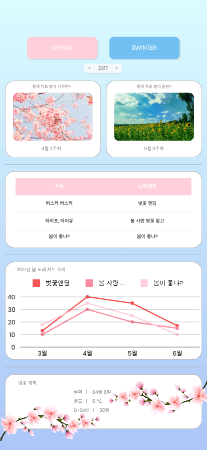
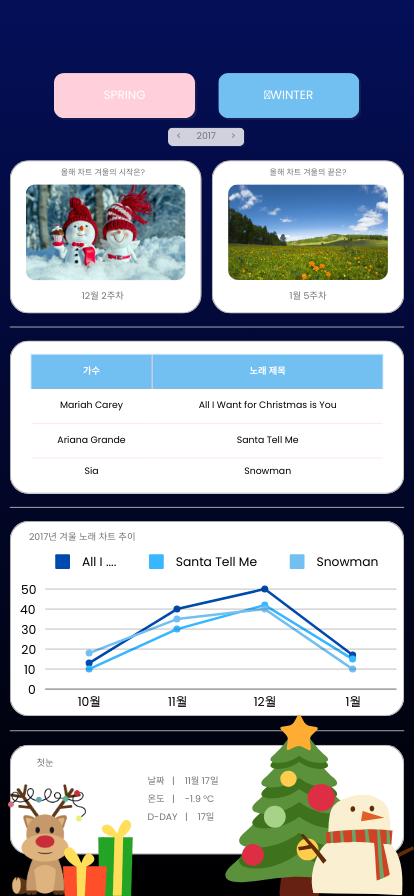
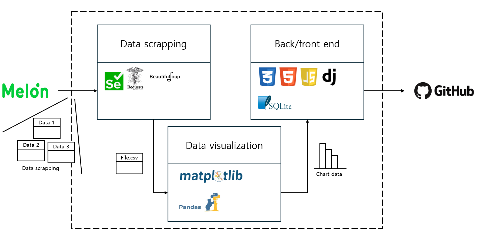

# Seasonal songs

## Skills & Tech Stack
     

## 프로젝트 목적
봄과 겨울, 사람들이 많이 찾는 음악이 무엇인지 알고자 한다. 봄과 겨울, 어떤 노래들이 지속적으로 상위권을 유지하는지 알고자 한다. 흥행한 노래의 사회적 분위기와 트렌드를 알고자 한다.

## 참여자

|  📎이하영 [@rehayoung](https://github.com/rehayoung)  | 📎이영준 [@dldudwns887](https://github.com/dldudwns887)  | 📎김승훈  [@zjacom](https://github.com/zjacom0) | 📎김태연  [@taeyeon5362](https://github.com/taeyeon5362)  | 📎최수범  [@SpaceSurfer051](https://github.com/SpaceSurfer051) |
| :----------------------------------------------------------: | :---------------------------------------------: | :-------------------------------------------------: | :---------------------------------------------: | :-------------------------------------------------: |
 

## 구현 화면
### prototype
 

### 메인
  

### 모달
 

## 프레임 워크 및 배포 환경

